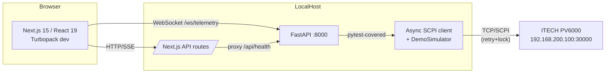

# 🔥 Agnipariksha (अग्निपरीक्षा)
### PV Module Reliability Test Station

> *Agnipariksha* — Sanskrit for "Trial by Fire" — the ultimate test of resilience.

A full-stack web + desktop application for programming the **ITECH PV6000 DC Power Supply** to perform 7 IEC-standard PV module reliability tests.

## 🧱 Architecture



---

## ⚡ One-Click Deploy

From a fresh clone (or any time you want to restart cleanly), run **one** command:

```bash
# Git Bash / WSL / macOS / Linux
bash ~/agnipariksha/deploy.sh
```

```powershell
# Windows PowerShell
pwsh C:\path\to\agnipariksha\deploy.ps1
```

`deploy.sh` / `deploy.ps1`:

1. fast-forwards `main` (skipped if you're on a feature branch),
2. frees ports `:8000` (backend) and `:3000` (frontend), killing recorded pids and any squatters,
3. runs `pip install -r backend/requirements.txt` and `npm install`,
4. starts the FastAPI backend (`python -m uvicorn main:app`) and Next.js frontend (`npm run dev:noclean`) in the background,
5. waits up to 30 s / 60 s for `GET /health` and `GET /` to return `200`, then prints **PASS / FAIL** with PIDs and log paths.

Logs land at `logs/backend.log` and `logs/frontend.log`. Pids at `logs/{backend,frontend}.pid`.

Shortcuts:

| Action | Bash | PowerShell | Make |
|--------|------|------------|------|
| Full deploy            | `bash deploy.sh` | `pwsh deploy.ps1` | `make deploy` |
| Restart backend only   | `bash backend/start.sh` | `pwsh backend/start.ps1` | `make backend` |
| Restart frontend only  | `bash frontend/start.sh` | `pwsh frontend/start.ps1` | `make frontend` |
| Stop everything        | — | — | `make stop` |
| Tail logs              | `tail -f logs/*.log` | `Get-Content -Wait logs\*.log` | `make logs` |
| Status (pids + ports + health) | — | — | `make status` |

Skip-flags: `bash deploy.sh --no-pull` (don't `git pull`) · `--no-install` (skip `pip` / `npm install`).

#### Stale RSC / Webpack errors in the browser

If `http://localhost:3000` still shows
`Module not found: Can't resolve 'react-server-dom-webpack/server'` (or any
mismatched-Next-version error) after pulling, an orphan dev server has
left a half-built `.next` while `node_modules` was on a different version.
Reset:

```bash
bash frontend/scripts/clean.sh        # rm .next, node_modules, lock; reinstall; build
bash deploy.sh --no-install           # restart services with the fresh modules
# or:  make clean-frontend && make deploy
```

PowerShell:

```powershell
pwsh frontend/scripts/clean.ps1
pwsh deploy.ps1 -NoInstall
```

---

## 🧪 Test Suite

| Tab | Test | Standard | Key Parameters |
|-----|------|----------|----------------|
| **TC** | Thermal Cycling | IEC 61215-2 MQT11 | 200 cycles, -40 to +85°C, I=Isc |
| **HF** | Humidity Freeze | IEC 61215-2 MQT12 | 85%RH, +85°C → -40°C |
| **LeTID** | Light & Elevated Temp Induced Degradation | IEC TS 63342:2022 | Idark=Isc-Imp @ 75°C, 162h |
| **BDT** | Bypass Diode Thermal | IEC 62979:2017 | 1.35×Isc for 1h |
| **RCO** | Reverse Current Overload | IEC 61730-2 MST26 | 135% fuse rating |
| **GCT** | Ground Continuity | IEC 61730-2 MST13 | 25A, R < 0.1Ω |
| **DH** | Damp Heat | IEC 61215-2 MQT 13 | 85°C / 85%RH, 1000h |

---

## 🚀 Quick Start

### Prerequisites
- Node.js 20+
- Python 3.11+
- Rust (for Tauri desktop build)

### 1. Clone
```bash
git clone https://github.com/ganeshgowri-ASA/agnipariksha
cd agnipariksha
```

### 2. Frontend (Web)
```bash
cd frontend
npm install
cp ../.env.example .env.local        # edit with your API keys
npm run dev                          # auto-kills any orphan on :3000, then starts Next.js
# Open http://localhost:3000
```

`npm run dev` runs `kill-port 3000 && next dev --turbopack -p 3000`, so a
stale Node from a previous session (the source of both `EADDRINUSE :::3000`
and the `EPERM ... @next/swc-win32-x64-msvc ... next-swc.win32-x64-msvc.node`
during reinstall) is reaped before the new server starts. If you ever need
the old behaviour, use `npm run dev:noclean`.

There are also platform-specific wrappers that do the same thing plus walk
listeners via `lsof` / `Get-NetTCPConnection`:

```bash
bash frontend/scripts/dev.sh         # Git Bash / macOS / Linux
pwsh frontend/scripts/dev.ps1        # Windows PowerShell
```

### 3. Backend (FastAPI — needed for live hardware)
The ASGI app is `main:app` (i.e. `backend/main.py`), **not** `app.main:app`.

```bash
cd backend
pip install -r requirements.txt
python -m uvicorn main:app --host 0.0.0.0 --port 8000     # canonical
# or use the wrapper scripts:
bash backend/run.sh                                       # Git Bash / macOS / Linux
pwsh backend/run.ps1                                      # Windows PowerShell
# or, from the repo root:
python -m backend                                         # equivalent fallback
# Runs on http://localhost:8000
```

### 4. Run both, one liner

Git Bash on Windows:
```bash
cd ~/agnipariksha \
  && (bash frontend/scripts/dev.sh &) \
  && bash backend/run.sh
```

…or two separate terminals:
```bash
# Terminal 1 — frontend
cd ~/agnipariksha/frontend && npm run dev

# Terminal 2 — backend
cd ~/agnipariksha/backend && python -m uvicorn main:app --host 0.0.0.0 --port 8000
```

### 5. Desktop App (Tauri)
```bash
cd frontend
npm run tauri
# Builds native .exe / .dmg / .deb
```

---

## 🎨 UI Features
- 📊 **Real-time strip charts** (Recharts) — Voltage, Current, Power vs time
- 🌡️ **Analog gauges** matching ITECH IT9000 style
- 🗂️ **Data tables** with per-row export
- 📄 **Word & PDF report generation** (docx.js + jsPDF) per test
- 🤖 **Claude AI Assistant** — anomaly detection, compliance Q&A
- 🎞️ **Demo mode** — 12 pre-loaded pass/fail scenarios
- 🔌 **Live hardware mode** — toggle to connect real ITECH PV6000

---

## 🛠️ Hardware
- **Device**: ITECH PV6000 Series DC Power Supply
- **Software**: IT9000 v1.0.3.3
- **Connection**: TCP SCPI at `192.168.200.100:30000`
- **Protocol**: Raw TCP socket, SCPI command set

---

## 🤖 AI MCP Capabilities
1. Analyse all test results — pass/fail summary
2. Detect anomalies in live V/I/P data
3. LeTID degradation trend prediction
4. IEC compliance check against limits
5. SCPI command generation from NL queries
6. Automated test report narrative

Requires `ANTHROPIC_API_KEY` in `.env.local`

---

## 📁 Project Structure
```
agnipariksha/
├── frontend/           # Next.js 15 + React 19
│   ├── app/            # App Router + AI API route
│   ├── components/
│   │   ├── tabs/       # TC, HF, LeTID, BDT, RCO, GCT
│   │   └── ui/         # Primitives (shadcn)
│   ├── hooks/          # useWebSocket
│   └── src-tauri/      # Tauri desktop wrapper (Rust)
├── backend/            # FastAPI + SCPI driver
└── CLAUDE.md           # Claude Code IDE guide
```

---

## 🛰️ Remote monitoring (V2-S7)

The backend now exposes a fan-out `/ws/events` WebSocket plus REST publishers
(`POST /api/events/alarm`, `POST /api/events/ticket`) so off-site dashboards,
tablets and mobile phones can stay in sync with the test station. All
`/api/*` and `/ws/*` endpoints honour a JWT bearer (HS256) when
`AUTH_ENABLED=true`; HTTP clients pass `Authorization: Bearer …`, WebSocket
clients pass `?token=…` on the connect URL.

### Cloudflare Tunnel — zero-port-forwarding remote access

```bash
# 1. Install cloudflared (Linux/macOS)
brew install cloudflared          # macOS
# or:  curl -L https://github.com/cloudflare/cloudflared/releases/latest/download/cloudflared-linux-amd64 \
#        -o /usr/local/bin/cloudflared && chmod +x /usr/local/bin/cloudflared

# 2. Authenticate against your Cloudflare account and create a named tunnel
cloudflared tunnel login
cloudflared tunnel create agnipariksha

# 3. Map a public hostname to the local services. The frontend already
#    rewrites /modules/*/label and /api/* to the backend, so a single
#    public ingress on :3000 is enough.
cat > ~/.cloudflared/config.yml <<'EOF'
tunnel: agnipariksha
credentials-file: /root/.cloudflared/agnipariksha.json
ingress:
  - hostname: agnipariksha.example.com
    service: http://localhost:3000
  - service: http_status:404
EOF

# 4. Point DNS at the tunnel and start it
cloudflared tunnel route dns agnipariksha agnipariksha.example.com
cloudflared tunnel run agnipariksha
```

> ⚠️ When exposing the test station publicly, set `AUTH_ENABLED=true` and
> issue JWTs from your SSO bridge. The `/api/auth/dev-token` endpoint is
> for **local development only** and is a no-op when auth is disabled.

### 📱 Barcode / QR scan + printable labels

- `/scan` — camera scan via [html5-qrcode](https://github.com/mebjas/html5-qrcode)
  plus a window-level USB-HID keyboard listener for hand scanners.
- `GET /modules/<id>/label`, `/equipment/<id>/label`, `/spare-parts/<id>/label`
  — server-rendered 3.5"×1.5" PDF labels (reportlab + QR) suitable for
  Zebra / Brother label printers.

Scanned IDs prefixed by `MOD-`, `EQP-`, or `SPR-` auto-route to the
correct detail view.

### 🔔 Web Push opt-in

The bell control in the app header lets operators opt into Web Push
notifications. Generate VAPID keys once, drop them into `.env`, and the
backend will deliver alarms and ticket events to subscribed devices.

### 📱 Mobile / tablet

The dashboard collapses non-flagship test tabs into a "More" menu at
phone widths, stacks live charts into a single column, and renders the
AI assistant as a bottom sheet. Playwright covers 360×640 and 768×1024
viewports — `npm run test:e2e` (after `npm run test:e2e:install`).

---

*Built with ❤️ for PV module reliability by Agni Labs*
